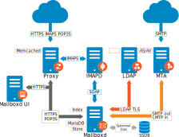

[[overview]]
= Product Overview
:toc:

This chapter provides a system overview of Zimbra components.

== Architectural Overview

The {product-name} architecture is built with well-known open source
technologies and standards-based protocols. The architecture consists of
client interfaces and server components that can run as a single node
configuration or be deployed across multiple servers for high availability
and increased scalability.

The architecture includes the following core advantages:

[cols="40,60",options="header",grid="rows"]
|=======================================================================
|Core Advantage |Components/Description

|Open source integrations |
Linux(R), Jetty, Postfix, MariaDB, OpenLDAP(R)

|Industry-standard open protocols |
SMTP, LMTP, SOAP, XML, IMAP, POP

|Modern technology Design |
HTML5, Javascript, XML, and Java

|Scalability |
Each Zimbra mailbox server includes its own mailbox accounts and associated
message store and indexes. The Zimbra platform scales vertically (by adding
more system resources) and horizontally (by adding more servers)

|Browser-based client interface .2+.^|
Easy, intuitive access to {product-name} features, using a standard
web platform.

|Browser-based Administration Console
|=======================================================================

== Core Email, Calendar and Collaboration Functionality

{product-name} is an innovative messaging and collaboration application
that offers the following state-of-the-art solutions that are accessed
through the browser based web client.

* Intuitive message management, search, tagging, and sharing.
* Personal, external, and shared calendar.
* Personal and shared Address Books and Distribution Lists.
* Personal and Shared Task lists.

== Zimbra Components

Zimbra architecture includes open-source integrations using industry
standard protocols. The third-party software listed in
<<table_tps,Third-Party Software>>
is bundled with Zimbra software and installed as part of the
installation process. These components have been tested and configured
to work with the software.

[[table_tps]]
.Third-Party Software
[cols="25,75a",options="header",grid="rows"]
|=======================================================================
|3rd-Party Component | Description

|Jetty |
Web application server that runs Zimbra software.

|Postfix |
Open source mail transfer agent (MTA) that routes mail messages to the
appropriate Zimbra server

|Open LDAP software |
Open source implementation of the Lightweight Directory Access Protocol
(LDAP) that stores Zimbra system configuration, the Zimbra Global Address
List, and provides user authentication. Zimbra can also work with GAL and
authentication services provided by external LDAP directories such as
Active Directory

|MariaDB |
Database software

|Lucene |
Open source full-featured text and search engine

| |
Third-party source that converts certain attachment file types to HTML

|Anti-virus/anti-spam |
Open source components that include:

* ClamAV, an anti-virus scanner that protects against malicious files
* SpamAssassin, a mail filter that attempts to identify spam
* Amavisd-new interfaces between the MTA and one or more content checkers

|Apache JSieve |
Manages filters for email

|LibreOffice |
High fidelity document preview
|=======================================================================

== Zimbra Application Packages

{product-name} provides the application packages listed in
<<table_app_pkgs,Application Packages>>.

[[table_app_pkgs]]
.Application Packages
[cols="25,75a",options="header",grid="rows"]
|=======================================================================
|Package |Description

|Zimbra Core |
The libraries, utilities, monitoring tools, and basic configuration
files. `zmconfigd` is contained in the zimbra-core and is automatically
enabled to run on all systems.

|Zimbra Store |
The components for the mailbox server (including Jetty). The Zimbra mailbox
server includes the following components:

* *Data store* -- A MariaDB database.

* *Message store* -- Location of all email messages and file attachments.

* *Index store* -- Index and search technology is provided through
Lucene. Index files are maintained for each mailbox.

* *Web application services* -- The Jetty web application server runs web
applications (webapps) on any store server. It provides one or more web
application services.

|Zimbra LDAP |
{product-name} uses the OpenLDAP(R) software, which is an open source LDAP
directory server. User authentication, the Zimbra Global Address List, and
configuration attributes are services provided through OpenLDAP. Note that
the Zimbra GAL and authentication services can be provided by an external
LDAP Directory such as Active Directory.

|Zimbra MTA |
Postfix is the open source mail transfer agent (MTA) that receives email
via SMTP and routes each message to the appropriate Zimbra mailbox server
using Local Mail Transfer Protocol (LMTP). The Zimbra MTA also includes the
anti-virus and anti-spam components.

|Zimbra Proxy |
Zimbra Proxy is a high-performance reverse proxy service for passing
IMAP[S]/POP[S]/HTTP[S] client requests to other internal {product-abbrev}
services.This package is normally installed on the MTA server(s) or on its
own independent server(s). When the zimbra-proxy package is installed, the
proxy feature is enabled by default. Installing the Zimbra Proxy is highly
recommended, and required if using a separate web application server.

|Zimbra Memcached |
Memcached is automatically selected when the zimbra-proxy is installed. At
least one server must run zimbra-memcached when the proxy is in use. You
can use a single memcached server with one or more Zimbra
proxies. zimbra-memcached is required if using a separate web application
server.

|Zimbra SNMP (Optional)|
If you choose to install zimbra-SNMP for monitoring, this package should be
installed on every Zimbra server.

|Zimbra Logger (Optional) |
If used, this is installed on one mailbox server, and must be installed at
the same time as the mailbox server.The Zimbra Logger installs tools for
syslog aggregation and reporting. If you do not install Logger, the *server
statistics* section of the Administration Console will not display.

|Zimbra Spell (Optional) |
Aspell is the open source spell checker used on the Zimbra Web Client. When
Zimbra-Spell is installed, the Zimbra-Apache package is also installed.

|Zimbra Apache |
This package is installed automatically when Zimbra Spell or Zimbra
Convertd is installed.

|Zimbra Convertd |
This package is installed on the zimbra-store server. Only one
Zimbra-convertd package needs to be present in the {product-name}
environment. The default is to install one zimbra-convertd on each
zimbra-store server. When Zimbra-Convertd is installed, the Zimbra-Apache
package is also installed.

|Zimbra Archiving (Optional)|
Archiving and Discovery offers the ability to store and search all messages
delivered to, or sent by the {product-name} Server. This package includes
the cross mailbox search function which can be used for both live and
archive mailbox searches. Note: Using Archiving and Discovery can trigger
additional mailbox license usage. To find out more about Zimbra Archiving
and Discovery, contact Zimbra sales.

|=======================================================================

== Mail Flow -- Multi-Server Configuration

The configuration for each deployment is dependent on numerous variables
such as the number of mailboxes, mailbox quotas, performance requirements,
existing network infrastructure, IT policies, security methodologies, spam
filtering requirements, and more. In general, deployments share common
characteristics for incoming traffic and user connectivity, as depicted in
the following diagram. Alternate methods for configuring numerous points
within the network are also possible.

image::images/mailflow.png[Mail Flow - Multi-Server Configuration]

The numbered sequences are described below:

. Inbound Internet mail goes through a firewall and load balancing to the
edge MTA for spam filtering.

. The filtered mail then goes through a second load balancer.

. An external user connecting to the messaging server also goes through a
firewall to the second load balancer.

. The inbound Internet mail goes to any of the {product-name} MTA servers
and goes through spam and virus filtering.

. The designated {product-name} MTA server looks up the addressee’s
directory information from the {product-name} LDAP replica server.

. After obtaining the user’s information from the {product-name} LDPA
server, the MTA server sends the mail to the appropriate {product-name}
server.

. Internal end-user connections are made directly to any {product-name}
server that then obtains the user’s directory information from
{product-name} LDAP and redirects the user, as needed.

. The backups from the {product-name} servers can be processed to a mounted
disk.

== Zimbra System Directory Tree

The following table lists the main directories created by the Zimbra
installation packages. The directory organization is identical for any
server in the {product-name}, when installing under (parent) `/opt/zimbra`.

[NOTE]
The directories not listed in the following table are
libraries used for building the core Zimbra software or
miscellaneous third-party tools.

// TODO: update for 8.7 changes with /opt/zimbra/common
.System Directory Tree under `/opt/zimbra`
[cols="30m,70",options="header",grid="rows"]
|=======================================================================
|File | Description

|backup/ |
Backup target contains full and incremental backup data

|bin/ |
{product-name} application files, including the utilities described
in <<command_line_utilities,Command-Line Utilities>>

|cdpolicyd |
Policy functions, throttling

|clamav/ |
Clam AV application files for virus and spam controls

|conf/ |
Configuration information

|contrib/ |
Third-party scripts for conveyance

|convertd/ |
Convert service

|cyrus-sasl/ |
SASL AUTH daemon

|data/ |
Includes data directories for LDAP, mailboxd, postfix, amavisd, clamav

|db/ |
Data Store

|docs/ |
SOAP txt files and technical txt files

|extensions-extra/ |
Server extensions for different authentication types

|extensions-network-extra/ |
Server extensions for different network version authentication types

|httpd/ |
Contains the Apache Web server. Used for both aspell and convertd as
separate processes

|index/ |
Index store

|java/ |
Contains Java application files

|jetty/ |
mailboxd application server instance. In this directory, the
`webapps/zimbra/skins` directory includes the Zimbra UI theme files

|lib/ |
Libraries

|libexec/ |
Internally used executables

|log/ |
Local logs for {product-name} server application

|logger/ |
RRD and SQLite data files for logger services

|mariadb/ |
MariaDB database files

|net-snmp/ |
Used for collecting statistics

|openldap/ |
OpenLDAP server installation, pre-configured to work

|postfix/ |
Postfix server installation, pre-configured to work with {product-name}

|redolog/ |
Contains current transaction logs for the {product-name} server

|snmp/ |
SNMP monitoring files

|ssl/ |
Certificates

|store/ |
Message store

|zimbramon/ |
Contains control scripts and Perl modules

|zimlets/ |
Contains Zimlet zip files that are installed with Zimbra

|zimlets-deployed/ |
Contains Zimlets that are available with the Zimbra Web Client

|zimlets-network/ |
Contains Zimlet zip files for features that are installed with the network
edition

|zmstat/ |
mailboxd statistics, saved as .csv files

|=======================================================================

== Zimbra Web Clients

Zimbra offers various web client types that users can log into for use
of Zimbra features. The web clients provide mail, calendar, address
book, and task functions.

.Zimbra Web Clients
[cols="25,75",options="header",grid="rows"]
|=======================================================================
|Client Type |Description

|Advanced Web Client |
Includes Ajax capability and offers a full set of web collaboration
features. This web client works best with newer browsers and fast Internet
connections.

|Standard Web Client |
A good option when Internet connections are slow or users prefer HTML-based
messaging for navigating within their mailbox

|Mobile Client |
(Native Mail Client) Used to configure and sync the Zimbra mailbox server
with the native mail client on a mobile device.

|Touch Client |
(Mobile Web App) Provides an experience for touch-capable mobile
devices. Its features are a subset of the features found in the Zimbra Web
Client, including Mail, Contacts and Calendar.

|Mobile HTML Client |
Provides mobile access to Zimbra when using the Standard Web Client
version.

|=======================================================================

When users sign in, they view the advanced Zimbra Web Client, unless they
use the menu on the login screen to change to the standard version.  If ZWC
detects the screen resolution to be 800x600, users are automatically
redirected to the standard Zimbra Web Client. Users can still choose the
advanced ZWC but see a warning message suggesting the use of the standard
ZWC for better screen view.

When connecting to Zimbra using a mobile web browser, Zimbra automatically
detects and defaults to the Touch Client. To use the Mobile Client, you
must configure your mobile device to sync with the Zimbra server.

== Web Services and Desktop Clients

In addition to using a web browser or mobile device to connect to
{product-name}, connection is available using a web service, such as
Exchange Web Services (EWS), or a desktop client such as Zimbra Connector
to Microsoft Outlook, which uses MAPI. The following are supported:

* *Exchange Web Services (EWS)* provides client access to enable
{product-name} to communicate with the Exchange Server when using Microsoft
Outlook on a Mac device. To enable EWS client access, see the Class of
Service section. EWS is a separately licensed add-on feature.

* *Messaging Application Programming Interface (MAPI)* synchronizes
to Microsoft Outlook 2016/2013/2010/2007/2003 with full delegate, offline
access and support for S/MIME. Use the Zimbra Connector for Outlook to
connect to {product-name} when using Microsoft Outlook on a Windows
device. To enable MAPI (Microsoft Outlook) Connector, see the Class of
Service section.

* Support for all POP3, IMAP4, Calendaring Extensions to Web Distributed
Authoring and Versioning (CalDAV), and vCard Extensions to Web Distributed
Authoring and Versioning (CardDAV) clients.

[[offline_mode]]
== Offline Mode

Zimbra Offline Mode allows access to data -- without network connectivity --
when using the Zimbra Web Client (ZWC).

For example, if there is no server connectivity or if server connectivity
is lost, ZWC automatically transitions to "`offline mode`".  When server
connectivity is restored, ZWC automatically reverts to "`online mode`".

The offline mode uses HTML5, which uses a caching capability that can be
considered a super set of the normal browser caching.

== Security Measures

The coordinated use of multiple security measures, targeted to increase the
security of the whole system, is one of the best approaches to securing
your information infrastructure. These measures are implemented in the
{product-name} platform as a result of defense mechanisms summarized in the
following topics:

[NOTE]
To view current and detailed security news and alerts, please refer to
https://wiki.zimbra.com/wiki/Security_Center[Security Center] on the
https://wiki.zimbra.com/[Zimbra Wiki].

=== Identity and Access Management

Key functions built into the system for user identity management are
summarized in the following table:

.Identity and Access Management Functions
[cols="25,75",options="header",grid="rows"]
|=======================================================================
|Function |Description

|Identity Lifecycle Management |
The leveraging of LDAP directory for all Create, Read, Update, and Delete
(CRUD) functions associated to user administration with
{product-name}. LDAP usage is optional but all attributes specific to
{product-name} are stored and managed through the native LDAP directory.

|First Factor Authentication |
The combined user name and password primarily employed by authorized users
when attempting to access the system. These credentials are retained in the
user store: the passwords are stored as salted hash that is compared
against that of the entered password, for rejection (no match) or
acceptance (matched). If external directory (LDAP or Active Directory) is
preferred, the appropriate login credentials can be stored in this external
LDAP directory. See also
<<zimbra_ldap_service,Zimbra LDAP Service>> for more details.

|Two Factor Authentication |
A second layer of identity security that is configured at the Admin Console
to enable or disable passcode generation to mobile devices associated with
{product-name}. When enabled, user or COS accounts must use the generated
passcode to gain access to their client services. See also
<<about_two_factor_auth,About 2 Factor Authentication>> and
<<two_factor_auth,Two Factor Authentication>>.

|Authorized Access |
User accounts are defined by various attributes, permission levels, and
policies to allow or disallow what data can be viewed and which functions
can be performed. Admin Console administrators can create groups and assign
access permissions to support targeted business objectives.

|=======================================================================

=== Information Security and Privacy

Functions built into the system to secure data are summarized in the
following table:

.Information Security and Privacy Functions
[cols="25,75",options="header",gird="rows"]
|=======================================================================
|Key Concept |Description

|Management of security, integrity, and privacy |
{product-name} supports the use of S/MIME certificates (provided by
publicly trusted Certification Authority (CA), as well as internal PKI;
DomainKeys Identified Mail (DKIM); Domain-based Message Authentication,
Reporting and Conformance (DMARC); Amavisd-new, which is housed in the Mail
Transfer Agent (MTA) to manage incoming and out going DMARC policies.

2+|*Encryption methods:*

|In-transit |
Secure connections between endpoints and services use TLS in addition to
various other protocols: SMTP, LMTP+STARTTLS, HTTPS, IMAPS/IMAP+STARTTLS,
POP3S/POP3+STARTTLS.

|At-rest |
With S/MIME for end-to-end encryption, data stored in a {product-name}
message store is encrypted until decryption occurs with the appropriate
private key.

|Anti-virus and Anti-spam |
Both malware and spam are challenged by the {product-name} native
functionality and third-party plugins: Amavisd-new, ClamAV, and Spam
Assassin.

|=======================================================================

=== System Logs

The {product-name} system logs -- generated by SNMP triggers -- can be used
to record data such as user and administrator activity, login failures,
slow queries, mailbox activity, mobile synchronization activity, and data
based errors. Events, alerts and traps can be forwarded to log management
and event correlation system to create centralized polices and
notifications based on your security and compliance requirements.

.Security Data
[cols="25,75",options="header",grid="rows"]
|=======================================================================
|Function |Description

|Incident response |
Administrators can use remote device wiping and/or account lockout in the
event of a malicious or accidental activities (such as stolen user account
credential, or lost smart phone).

|Archiving and discovery |
This optional feature allows administrators to select specific user email
messages for archival and application of retention policies, which can be
used for both archived and live mailboxes.

|=======================================================================
