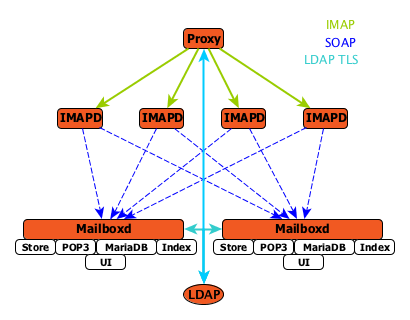
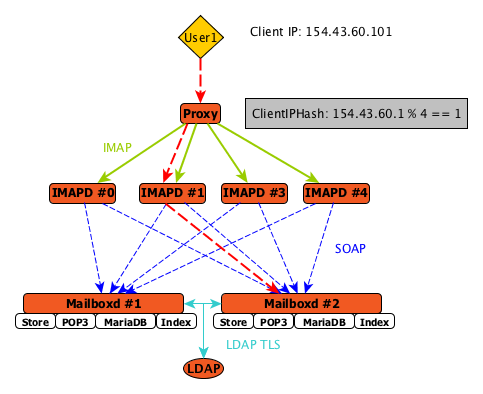

= Multi-Node Configuration with Standalone IMAPD

The {product-name} supports remote IMAP servers which are run separately
from the mailbox process.

Example multi-node environment:

- 1 Proxy node
- 4 IMAPD nodes
- 2 Mailbox nodes
- 1 LDAP node

<<<

== IMAPD Server selection

The {product-name} Proxy selects the IMAPD server to send IMAP(S) requests to based
on the configured IMAP load balancing strategy.

Currently the following load balancing strategies exist:

* Hash of the client's originating ip address - *ClientIPHash*
* Custom load balancing class installed by customer

NOTE: When the custom load balancing class CAN NOT be found the load balancing algorithm
      falls back to the *ClientIPHash* algorithm.

== Client Request Flow

An IMAP request from a client is processed by the Proxy and is sent to the designated
IMAPD server based on the configured load balancing strategy.  In the diagram the *ClientIPHash* is being utilized to select the appropriate IMAPD server for the request.  The algorithm used to select the IMAPD server is configurable using the ** option.

Setup: Users *user1* and *user2* have each been provisioned on *Mailboxd #1* and *Mailboxd #2* respectively.

The process is as follows:

* Client IMAP request is received by Proxy.
* **ClientIPHash** is used to compute the index of the IMAPD server to service the request.
* IMAP request is forwarded to *IMAPD #1* process.
* *IMAPD #1* locates the mailbox server that contains the requester's mailbox.
* *IMAPD #1* processes the request by submitting SOAP requests to *Mailboxd #2*.
