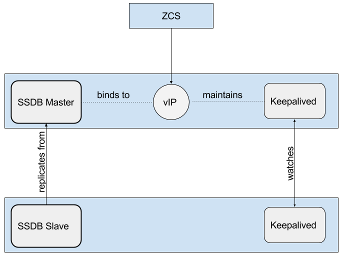
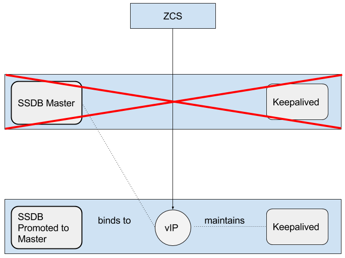
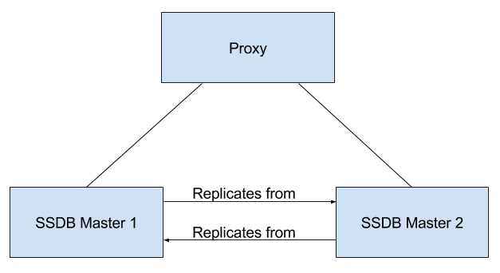
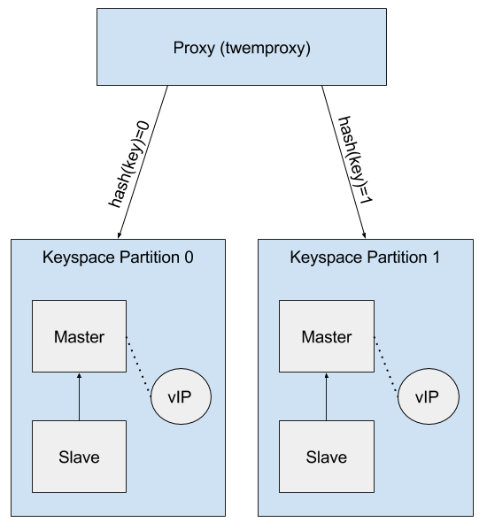

= SSDB Installation and Configuration

== Installation

{product-name} packages do not include SSDB server and {product-name} installation and configuration utilities do not alter SSDB configuration. To install the latest version of SSDB, follow instructions provided by SSDB developer community in http://ssdb.io/docs/install.html[SSDB Installation Documentation]. Please note, that {product-name} has been tested with SSDB version 1.9.5. In order to install SSDB 1.9.5, download  https://github.com/ideawu/ssdb/tree/stable-1.9.5[stable-1.9.5.zip] instead of https://github.com/ideawu/ssdb/archive/master.zip[master.zip] when following http://ssdb.io/docs/install.html[SSDB installation instructions].

== Overview of Configuration Options

The purpose of this guide is to discuss some of the options available
with `SSDB`, specifically with regards to:

* High-availability via master-slave replication
* High-availability via master-master replication
* Horizontal scaling, with high-availability, via multi-master
  configuration.

This guide is not meant to be an exhaustive treatment of the subject.
Also, as of the time of this writing, `SSDB` and any related packages
must be installed and configured by the system administrator prior to
updating `zimbraEphemeralBackendURL` and migrating attributes.

`SSDB` is compatible with https://redis.io/[Redis] clients and
{product-name} currently uses a `Redis`-compatible client for
communication with `SSDB`, so many of the concepts described herein
are applicable with a `Redis` backend.

=== High-availability with Master-Slave replication

==== Normal Operation

The method described in this document to implement master-slave
replication makes use of http://www.keepalived.org/[Keepalived] to
maintain a configured virtual IP address that is bound to the master
`SSDB` instance under normal conditions.

==== Fail-over

If `Keepalived` detects a failure of the master instance, then the
backup instance is promoted to master by re-binding the virtual IP
address to the backup.

=== High-availability with Master-Master replication

This differs from master-slave replication in that both `SSDB`
instances are online and accessible.  Each replicates changes from the
other.  In the example set-up described later, we use
http://www.haproxy.org/[HAProxy] as a front-end.  Keep in mind that,
for production, you must use a proxy service that is, itself, highly-available.

=== Horizontal Scaling via Multi-Master Configuration

Normally, both `SSDB` and `Redis` contain the entire key-space in a
single instance.  It is possible to front-end multiple instances using
a service such as https://github.com/twitter/twemproxy[twemproxy].  It
supports various hashing modes such that the data associated with a
particular key is always stored on the same server.  This allows for
horizontal scaling with very large installations.

By configuring each `SSDB` instance in master-slave configuration, you
get both horizontal scaling and high-availability.

== Master-Slave Replication

One way to ensure that `SSDB` remains highly-available is to set-up
master-slave replication and configure a system that will allow the
backup `SSDB` instance to automatically take-over in the event that
the primary instance goes down.  This document will describe one
technique for accomplishing that goal.

=== Overview

`SSDB` will be installed on two servers.  It will be configured such
that one server is the designated master and the other server is the
designated slave, or backup, that will constantly replicate changes
from the master server.

`Keepalived` will also be installed on these two servers.  Each
`Keepalived` instance will monitor the other.  In the event that the
master server goes down, `Keepalived` will detect that failure and
promote the slave, or backup, server to master.  `Keepalived` will
maintain a https://en.wikipedia.org/wiki/Virtual_IP_address[Virtual
IP address] bound to whichever server is the current master.

{product-name} will be configured such that the
`zimbraEphemeralBackendURL` will bind to the _Virtual IP address_ that is
being maintained by `Keepalived`.

Once the installation and configuration of _both_ the `SSDB`
master-slave setup and {product-name} have been completed, follow the
instructions in <<_ephemeral_data>> to update the
`zimbraEphemeralBackendURL` accordingly.

The example documented here was done on servers running
http://releases.ubuntu.com/16.04/[Ubuntu 16.04].

=== Required Packages

* http://ssdb.io/[SSDB]
* http://www.keepalived.org/[Keepalived]

=== Prerequisites

Install `SSDB` and `Keepalived` on two servers in accordance with the
procedure that is applicable to the Linux distribution that you are
using.

=== Configuration

The following configuration steps assume that you have installed
`SSDB` to `/var/lib/ssdb` and that all `SSDB` configuration files are
located in that same directory.  It further assumes that the internal
host addresses are on the `192.168.56/24` network.

- `192.168.56.111` - This is IP address of the initial master `SSDB`
  server
- `192.168.56.112` - This is the IP address of the initial slave `SSDB` server
- `192.168.56.120` - This is the virtual IP address that will be maintained by
  `Keepalived`.

==== SSDB Configuration, Designated (Initial) Master

The IP address of this machine is `192.168.56.111`.

`/var/lib/ssdb/ssdb_master.conf`

The key configuration items in the following block are:

- `server/ip` - Binding to all available IP addresses
- `server/port` - Binding to standard `SSDB` port
- `server/deny`, `server/allow` - Restrict `SSDB` access to `localhost` and the internal (host) addresses.`

Only the configuration items related to master-slave replication are
shown here.

-------------------------------------------
# ssdb-server config
# MUST indent by TAB!

# relative to path of this file, directory must exists
work_dir = ./var
pidfile = ./var/ssdb.pid

server:
        ip: 0.0.0.0
        port: 8888
        deny: all
        allow: 127.0.0.1
        allow: 192.168.56

replication:
        binlog: yes
        # Limit sync speed to *MB/s, -1: no limit
        sync_speed: -1
        slaveof:
                # sync|mirror, default is sync
                #type: sync
-------------------------------------------

`/var/lib/ssdb/ssdb_slave.conf`

The key configuration items in the following block are:

- `server/ip` - Binding to `localhost`
- `server/port` - Binding to standard `SSDB` port
- `slaveof/type` - `sync`
- `slaveof/host` - `192.168.56.112` is the other `SSDB` server
- `slaveof/port` - `8888` - The standard `SSDB` port

Again, only the configuration items related to master-slave
replication are show.

-------------------------------------------
# ssdb-server config

# relative to path of this file, must exist
work_dir = ./var_slave
pidfile = ./var_slave/ssdb.pid

server:
        ip: 127.0.0.1
        port: 8888

replication:
        binlog: yes
        # Limit sync speed to *MB/s, -1: no limit
        sync_speed: -1
        slaveof:
                # sync|mirror, default is sync
                type: sync
                # Can use host: <hostname> with SSDB 1.9.2 or newer
                ip: 192.168.56.112
                port: 8888

-------------------------------------------

==== SSDB Configuration, Designated (Initial) Slave

The IP address of this machine is `192.168.56.112`.

The `ssdb_master.conf` file is identical to that of the designated
master server.

The `ssdb_slave.conf` file is almost identical to that of the
designated master server.  Only the following items differ;

- `slaveof/ip (or host)` - `192.168.56.111` is the other `SSDB` server

==== Keepalived configuration, Designated (Initial) Master

`/etc/keepalived/keepalived.conf`

The key configuration items to note are:

- `state` -  State is set to `BACKUP` for _both_ the designated
  (initial) master and backup servers.  In this scenario, the
  `priority` is used to negotiate which server will assume `MASTER`
  status initially.
- `nopreempt` - In the event that the master server fails and the
  backup server is promoted to master, this configuration directive
  will keep the original master from reclaiming that role should it
  come back online automatically.  This is required because it will
  likely be stale.  In this case, when it comes back up, it will
  remain in backup mode and will begin replicating information from
  the new master. _Note_: Human intervention may be required to bring
  a failed master back into service.
- `interface` - In this example, `enp0s8` is the interface identifier
  for which the `virtual_ipaddress` will be defined.  You will choose
  a value that is appropriate to your installation.
- `priority` - The designated initial master must have a higher
  priority than the designated initial backup.
- `advert_int` - For the purposes of this documentation, the default value of
   1 second was use.  If you install `Keepalived` `1.2.21` or newer, you
   can specify a floating-point value here; e.g., `0.1` (seconds).
  This will allow `Keepalived` to detect a master failure more rapidly.
- `notify` - This is the path to a script that will be called for
  state transitions.  The full contents of the script is shown below
- `virtual_ipaddress` - This is the virtual IP address that is
  maintained by `Keepalived`.

-------------------------------------------
vrrp_instance VRRP1 {
        state BACKUP
        nopreempt
        interface enp0s8
        virtual_router_id 41
        priority 200
		advert_int 1
        notify /var/lib/ssdb/notify.sh

        authentication {
                auth_type PASS
                auth_pass 1234
        }
        virtual_ipaddress {
                192.168.56.120 dev enp0s8 label enp0s8:vip
        }
}
-------------------------------------------

`/var/lib/ssdb/notify.sh`

This is the script that is called by `Keepalived` during state
transitions.  Note that the value assigned to `USER` should be the
username that owns the `SSDB` process.

[source,bash]
-------------------------------------------
#!/bin/bash
# This must be run as root.

ENDSTATE=$3
NAME=$2
TYPE=$1

LOG=/var/log/keepalived-state-transition.log
LOG_ERROR=0
LOG_WARNING=1
LOG_INFO=2
LOG_DEBUG=3
LOG_LEVEL=$LOG_INFO

KPCFG=/etc/keepalived/keepalived.conf
USER=<SSDB-user-name>
PREFIX=/var/lib/ssdb

function log {
    lvl=$1
    msg="$2"
    if [ $lvl -le $LOG_LEVEL ]
    then
        now=$(date)
        echo "$now [$lvl] $msg" >> $LOG
    fi
}

function log_error {
    log $LOG_ERROR "$1"
}
function log_warning {
    log $LOG_WARNING "$1"
}
function log_info {
    log $LOG_INFO "$1"
}
function log_debug {
    log $LOG_DEBUG "$1"
}

function backup {
    log_info "Transitioning to BACKUP state"
    runuser -l $USER -c "${PREFIX}/ssdb-server ${PREFIX}/ssdb.conf -s stop"
    runuser -l $USER -c "cp ${PREFIX}/ssdb_slave.conf ${PREFIX}/ssdb.conf"
    runuser -l $USER -c "${PREFIX}/ssdb-server -d ${PREFIX}/ssdb.conf"

}

function fault {
    log_error "keepalived is in FAULT state"
}

function master {
    log_info "Transitioning to MASTER state"
    runuser -l $USER -c "${PREFIX}/ssdb-server ${PREFIX}/ssdb.conf -s stop"
    runuser -l $USER -c "cp ${PREFIX}/ssdb_master.conf ${PREFIX}/ssdb.conf"
    runuser -l $USER -c "${PREFIX}/ssdb-server -d ${PREFIX}/ssdb.conf"
}

case $ENDSTATE in
    "BACKUP") # Perform action for transition to BACKUP state
        backup
        exit 0
        ;;
    "FAULT")  # Perform action for transition to FAULT state
        fault
        exit 0
        ;;
    "MASTER") # Perform action for transition to MASTER state
        master
        exit 0
        ;;
    *)    echo "Unknown state ${ENDSTATE} for VRRP ${TYPE} ${NAME}"
        exit 1
        ;;
esac
-------------------------------------------

==== Keepalived configuration, Designated (Initial) Backup

`/etc/keepalived/keepalived.conf`

This file is almost identical to the same file on the master node.
Exceptions:

- `priority` - It is given a lower initial priority.
- It does not contain the `nopreempt` option.  Once the backup server
  has become master due to a failure of the original master, the
  system should allow for some human intervention before restoring
  the original server to master status.

-------------------------------------------
vrrp_instance VRRP1 {
        state BACKUP
        interface enp0s8
        virtual_router_id 41
        priority 100
        advert_int 1
        notify /var/lib/ssdb/notify.sh

        authentication {
                auth_type PASS
                auth_pass 1234
        }
        virtual_ipaddress {
                192.168.56.120 dev enp0s8 label enp0s8:vip
        }
}
-------------------------------------------

The `/var/lib/ssdb/notify.sh` for the backup server is identical to
the master.

== Master-Master Replication

=== Overview

Another way to ensure that `SSDB` remains highly-available is to set-up
master-master replication and configure a proxy that understands
`Redis` protocol in front of the two `SSDB` servers.  The proxy is
responsible for monitoring the health of the two servers and removing
a failed server from the poop.

The following simplified example uses a single `HAProxy` instance in
front of two `SSDB` servers.

=== Required Packages

* http://ssdb.io/[SSDB].  In the examples shown below it is assumed
  that version `1.9.2` or newer is installed.
* http://www.haproxy.org/[HAProxy]

=== Prerequisites

Install `SSDB` on two servers in accordance with the
procedure that is applicable to the Linux distribution that you are
using. Install `HAProxy` on an additional server.  Note that
http://www.keepalived.org/[Keepalived] can be used to configure a
highly-available pool of `HAProxy` servers.

=== Configuration

==== SSDB Configuration, First Master

Notes:

* Only the configuration related to master-master replication is
  shown.

-------------------------------------------
# ssdb-server config
## ssdb-server config MUST indent by TAB!

# relative to path of this file, directory must exists
work_dir = ./var
pidfile = ./var/ssdb.pid

server:
        ip: 0.0.0.0
        port: 8888
        deny: all
        allow: 127.0.0.1
        # e.g., 192.168.56
        allow: <ip-address-prefix>

replication:
        binlog: yes
        # Limit sync speed to *MB/s, -1: no limit
        sync_speed: -1
        slaveof:
                id: svc_2
                type: mirror
                host: <hostname-of-other-master>
                port: 8888
-------------------------------------------

==== SSDB Configuration, Second Master

Notes:

* Only the configuration related to master-master replication is
  shown.

-------------------------------------------
# ssdb-server config
# MUST indent by TAB!

# relative to path of this file, directory must exists
work_dir = ./var
pidfile = ./var/ssdb.pid

server:
        ip: 0.0.0.0
        port: 8888
        deny: all
        allow: 127.0.0.1
        # e.g., 192.168.56
        allow: <ip-address-prefix>

replication:
        binlog: yes
        # Limit sync speed to *MB/s, -1: no limit
        sync_speed: -1
        slaveof:
                id: svc_1
                type: mirror
                host: <hostname-of-other-master>
                port: 8888

-------------------------------------------

==== HAProxy Configuration

Notes:

* Only the configuration related to `SSDB` is shown.
* `SSDB` supports `Redis` network protocol. You can use `Redis` clients to
connect to an `SSDB` server and operate on it. This is what
{product-name} does.

-------------------------------------------
defaults REDIS
        mode tcp
        timeout connect  4s
        timeout server  30s
        timeout client  30s

frontend ft_redis
        bind <published-ip-address>:8888 name redis
        default_backend bk_redis

backend bk_redis
        option tcp-check
        server R1 <first-master-ip-address>:8888 check inter 1s
        server R2 <second-master-ip-address>:8888 check inter 1s

-------------------------------------------

== Multi-Master Scaling / Replication

=== Overview

The details of multi-master configuration will not be covered in this
document.  In essence, you will install and configure multiple
independent `SSDB` master-slave pairs using the instructions included
above. Each pair will be responsible for storing a subset of the total
key-space.

As in the master-master configuration, all of the pairs in the pool of `SSDB`
servers will be front-ended by a proxy service that understands
`Redis` protocol.  It must also be capable of consistently hashing the
data keys that are presented such that all requests relating to a
particular key always get routed to the same master-slave pair.

One such product is https://github.com/twitter/twemproxy[twemproxy]
from https://github.com/twitter[Twitter]. 

== LDAP Attributes

The the SSDB backend makes use of a resource pool to manage access to the
`SSDB` server; threads attempting ephemeral data operations must first 
acquire a resource from this pool. To that end, two LDAP attributes have
been introduced to control the pool configuration.

`zimbraSSDBResourcePoolSize` controls the size of the pool. This determines
how many client threads can simultaneously perform ephemeral API operations.
By default this is set to 0, which results an unlimited pool size.

`zimbraSSDBResourcePoolTimeout` controls the amount of time a thread will
wait for a resource before throwing an exception. The default is 0,
which results in no timeout. This attribute has no effect when the pool size
is 0, as threads will never have to wait for resources to be freed in order
to perform ephemeral data operations.

A non-zero timeout value is recommended when the pool size is finite. 
Otherwise, a lost `SSDB` connection may cause mailboxd threads to remain
blocked indefinitely, even after the connection is re-established. 
In general, the resource pool should be sized such that the mailbox server
is not starved for resources.

== Scaling SSDB for Production Load with {product-name}
The main characteristics of {product-name} production load that affects load on SSDB server are the frequency of authentication requests and frequency of SOAP requests sent by {product-name} Web Client and 3rd party SOAP clients. Each authentication request results in a 2 or 3 write operations for SSDB. The write operations update zimbraLastLogonTimestamp, zimbraAuthTokens and zimbraCsrfTokenData values. Note, that zimbraCsrfTokenData is updated only when using a CSRF-enabled SOAP client such as {product-name} Web Client. Each authenticated SOAP request results in 2 read operations for SSDB.

=== Minimum Recommended SSDB Configuration
We recommend that your SSDB server has at least 2GB RAM and 1 CPU. If you plan on running additional tools, such as monitoring and configuration management on your SSDB server, consider increasing memory and adding one more CPU core to accommodate additional software. Check out https://github.com/Zimbra/zm-ssdb-ephemeral-store/wiki/Zimbra-and-SSDB-Authentication-Load-Tests[Zimbra and SSDB Authentication Load Tests] for more information.

== Conclusion

For installations whose ephemeral data storage requirements will fit
in a single instance, simple master-slave replication is the easiest
to implement and requires the fewest resources.  Master-master
replication does allow requests to be load-balanced across both
masters; however, each master is also constantly replicating from the
other, so `SSDB` must do additional work to maintain
consistency.