:ztalk-name: Zimbra Talk V2
= {ztalk-name}
:toc:

== What is {ztalk-name}

// Conditionally include version introduction, to only appear in specified release
ifeval::["{product-version}" == "8.8.8"]
New for {product-name} {product-version},
endif::[]
//
{ztalk-name} integrates a fully fledged corporate instant messaging platform inside the Zimbra WebClient, including Group and Corporate Messaging, File Sharing, Screen Sharing and informal Videoconferencing capabilities.

=== Differences with Zimbra Talk (Legacy)

The main differences between {ztalk-name} and the legacy Zimbra Talk
implementation are the following:

* No third-party products involved
* No additional resources required
* Improved usability and UI
* No installation required (the {ztalk-name} core is included in Zimbra
Network Edition starting from version 8.8.8)
* Peer-to-Peer protocols to avoid overloading Zimbra

On a practical level, {ztalk-name} is both easier to use and to manage and
provides more features to end users.

=== Frontend Features

{ztalk-name} includes the following front-end features:

* Buddy List management and Presence
* Message delivery and read awareness
* 1-to-1 Instant Messaging
* Group Messaging
* Corporate Messaging (Spaces and Channels)
* Group Videoconferencing
* Channel Videoconferencing w/ unlimited participants
* File Sharing
* Screen Sharing
* Emojis

=== Backend Features

{ztalk-name} includes the following backend features:

* COS and User availability
* XMPP compatibility for 1-to-1 IM
* Built-in TURN server compatibility
* No core installation needed. Zimlet installation through a package
manager.
* No configuration needed
* Peer-to-Peer WebRTC protocol to avoid server load
* Dedicated audit log

== Licensing

{ztalk-name} is licensed on a per-user basis. License information is
included in the Network Edition license file just as for any other
Zimbra NE feature. Its Advanced features can be enabled by Global Admins
to any number of users up to the limit allowed by the license, and only
«advanced» users count towards any licensing limit.

== Zimbra Chat and {ztalk-name}

Zimbra Chat and {ztalk-name} are not compatible and interoperable,
meaning that the two products cannot coexist on any Zimbra NE
infrastructure. The Zimbra Chat zimlet is uninstalled during the
installation process of the {ztalk-name} Zimlet package. However, {ztalk-name}
includes all «basic» IM features provided by Zimbra Chat which will
be automatically enabled for all users who don’t have access to the
«advanced» {ztalk-name} features. «Advanced» users are able to use all
of the product’s features with other «advanced» users and to use 1-to-1
Instant Messaging with «basic» users, while «Basic» users are allowed to
use the basic 1-to-1 features with all other users.

All users start off as «Basic» users, and the «Advanced» features can be
enabled by Global and Delegated admins.

== {ztalk-name} Zimlet installation

The {ztalk-name} Zimlet is available in the Zimbra repository and can be
easily installed and upgraded through the operating system's package
manager.

=== {ztalk-name} Zimlet installation on Red Hat and CentOS

On Red Hat and CentOS, simply run

....
yum install zimbra-talk
....

to install the Zimlet.

=== {ztalk-name} Zimlet installation on Ubuntu

On Ubuntu, simply run

....
apt-get install zimbra-talk
....

to install the Zimlet.

Installing the Zimlet will automatically remove any Zimbra Chat
components from the server, as {ztalk-name} includes all the Zimbra Chat
features.

== {ztalk-name} administration

In the Zimbra Administration Console, a new section is added to the
lefthand menu of both Classes of Service and Users that allows to:

* Enable {ztalk-name} «Advanced» features for that CoS/User
* Enable or disable the chat history for that CoS/User
* Enable or disable Videoconferencing for that CoS/User

The same options can also be found in the «Global Settings» section of
the Admin Console.

== Browser compatibility

{ztalk-name} features are available on all browsers officially
supported by the Zimbra Web Client, with some client-side limitations:

[cols=",,,,",options="header",]
|======================================================
|Browser |IM Panel |Talk Tab |Videochat |Screen sharing
|Internet Explorer 9/10 |Yes |No |No |No
|Internet Explorer 11+ |Yes |Yes |No |No
|Microsoft Edge |Yes |Yes |No |No
|Mozilla Firefox |Yes |Yes |Yes |Yes
|Google Chrome |Yes |Yes |Yes |Yes (w/ extension)
|Safari |Yes |Yes |Yes |No
|======================================================

Google Chrome users must install the "Zextras Companion" extension in
order to use the Screen Sharing feature, publicly available in the
Chrome Web Store.

Firefox users must be sure to be running at least version 52 of the
browser in order to be able to use the Screen Sharing feature.

== UI

The {ztalk-name} UI is developed in REACT and seamlessly integrated with
the Zimbra Web Client. It is composed of two client-side components: the
IM Panel and the fully featured Talk Tab.

The IM Panel is inherited from Zimbra Chat and allows for quick Instant
Messaging, both for 1-to-1 and group conversations. Advanced {ztalk-name}
features such as File Sharing and Videoconferencing are available in the
IM Pane only for users who have the {ztalk-name} feature set enabled either at
account or COS level. This is available to both Basic and Advanced
users.

The Talk Tab is the full-sized {ztalk-name} UI, which contains all corporate
instant messaging features such as Spaces and Channels. This is only
available to Advanced users.

=== IM Panel

The IM Panel is inherited from Zimbra Chat and includes the very same
features for "Basic" users as well as a few new additions for "Advanced"
users, such as groups, file sharing and videoconferencing.

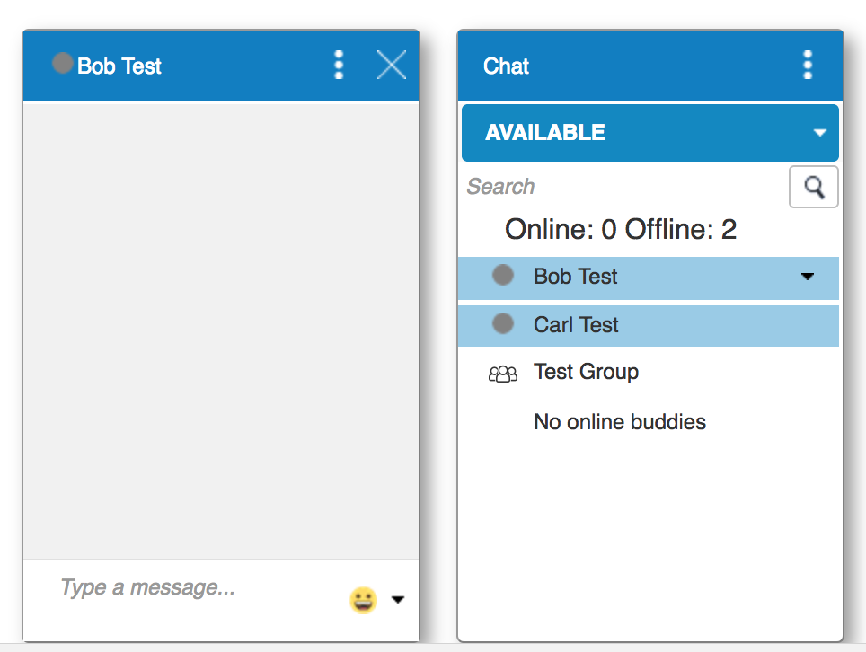

Advanced features such as File Sharing and Videoconferencing can be
found in the options menu on the top-right corner of the IM window.

image:images/im_panel_features_1.png[im_panel_features_1.png,title="im_panel_features_1.png"]

=== Talk Tab

The Talk Tab is a fully fledged Zimbra feature tab that can be
interacted with in the same way as all other feature tabs (e.g. Mail or
Calendar).

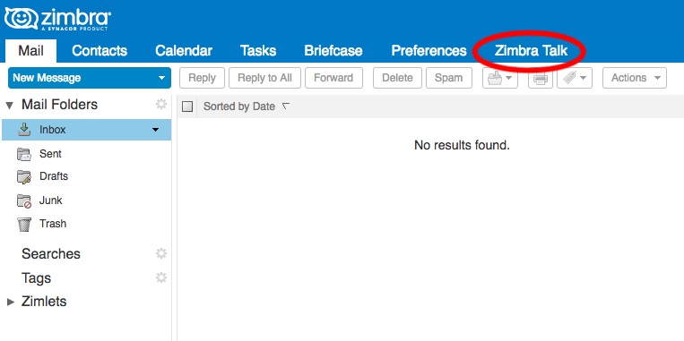

image:images/home.jpg[home.jpg,title="home.jpg"]

=== Buddy List Management and Conversations

The same Buddy List and Conversations found in the IM Panel can be also
found in the "Buddies" section of the Talk Tab.

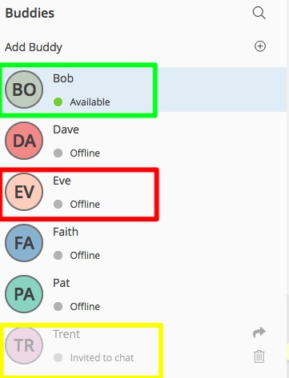

== Groups, Spaces and Channels

End users will be faced with three new "concepts" in {ztalk-name}:
Groups, Spaces, and Channels.

=== Groups

Groups are the basic way of communicating with multiple people at the
same time (up to 5 total). Those are non-persistent entities that are
not tied to any specific space: any user can create a group inviting
people from their Buddy List and any group member can invite more people
in the same way. When all users leave a group, the group itself ceases
to exist.

==== Groups Features

* A user in a Group can add more users to the Group itself up to the
allowed limit.
* A user in a Group can chat with all of the others. Messages sent in a Group are viewed by all members of that Group.
* A user in a Group can send files to all of the others. Files sent in a Group are available to all members of that Group.
* An user in a Group can start a video chat with all of the others.
Group video chats can be joined at any time by all members of the
Group.

==== Groups UI

Groups are contained in a dedicated section of the Talk Tab, which
allows access to all Group-related features:

* Creating a Group
+
To create a new Group, click on the "New Group" button in the "Groups"
section of the Talk Tab
+
image:images/create_new_group_1.jpg[create_new_group_1.jpg,title="create_new_group_1.jpg"]
+
then, add the Group's title, select the buddies you wish to invite and
click on "Create"
+
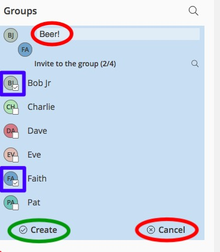

* Inviting a buddy to a Group
+
To invite one or more buddies to a Group, first expand the Group's
options and click on "Invite"
+
image:images/add_buddy_to_group_1.jpg[add_buddy_to_group_1.jpg,title="add_buddy_to_group_1.jpg"]
+
then select the buddies you want to invite and click on "Invite" when
done.
+
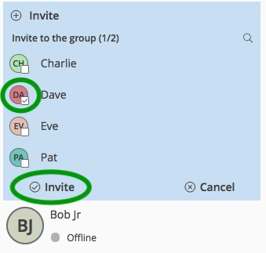

* Sending an email to all members of a Group
+
To send an email to all members of a Group, click on the "New Mail"
button in the Group's options.
+
image:images/new_mail_group_1.png[new_mail_group_1.png,title="new_mail_group_1.png"]

* Sending a file to all members of a Group
+
To send a file to all members of a group, click on the "paperclip" icon
in the Group's chat window.
+
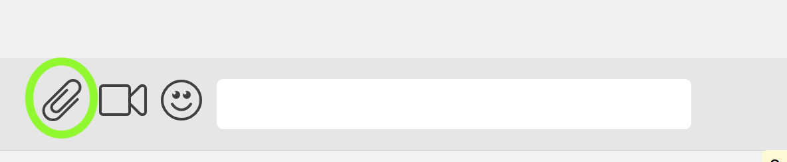
+
Files sent to a group will be uploaded in a dedicated personal briefcase
before being shared.

* Starting a Group video chat
+
To start a Group video chat, click on the "Camera" icon on the
Group's chat window.
+
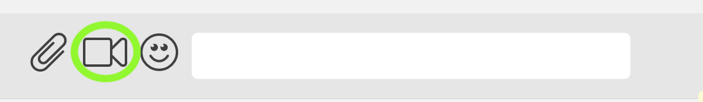
+
Any member of the Group can join the call at any time by clicking on the
same button.

* Leaving a Group
+
To leave a Group, first click on "Leave Group" in the Group's properties
+
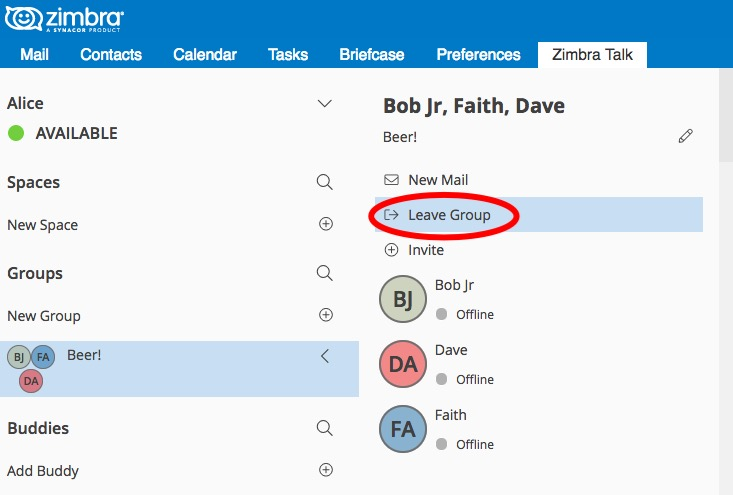
+
then, click on "Leave" under the warning message.
+
image:images/leave_group_2.jpg[leave_group_2.jpg,title="leave_group_2.jpg"]

=== Spaces

Spaces are a themed container that can hold any number of Channels.
Think of a Space as a community center where people gather to discuss
different topics in dedicated areas (named Channels).

==== Spaces Features

* Each space has a unique name and topic. The name cannot be changed
after creating the space while the Topic can be changed by clicking the
"Edit" icon next to the topic itself.
* Users in a space can send an email to all members of that very same space by clicking on the "New Mail" button below the space's name and
topic.
* Members can leave a space at any time by clicking the "Leave Space"
button.
* Members can create new channels and invite new people to the space
using the appropriate buttons (respectively, "New Channel" and
"Invite").

==== Spaces UI

Spaces are contained in a dedicated section of the Talk Tab, which
allows access to all Space-related features:

* Creating a Space
+
To create a new Space, first click on the "New Space" button in the
"Spaces" section of the Talk Tab
+
image:images/new_space_1.jpg[new_space_1.jpg,title="new_space_1.jpg"]
+
then, enter the Space's name and topic, select any buddies to invite and
finally, click on "Create".
+
image:images/new_space_2.jpg[new_space_2.jpg,title="new_space_2.jpg"]

* Sending an email to all members of a Space
+
To send an email to all members of a Space, click on the "New Mail"
button in the Space's options.
+
image:images/new_mail_space_1.png[new_mail_space_1.png,title="new_mail_space_1.png"]

* Leaving a Space
+
To leave a Space, click on the "Leave Space" in the Space's properties.
+
image:images/leave_space_1.jpg[leave_space_1.jpg,title="leave_space_1.jpg"]

=== Channels

Channels are topic-defined areas inside of the same space. Those can
contain any number of users, and unlike groups, users are able to
autonomously join any Channel in a Space they are in instead of being
invited to it by a member.

Every time a new Space is created, a "General" channel is automatically
created within it, which all users automatically join when they join the
Space itself.

==== Channels Features

* A user in a Channel can chat with all of the others. Messages sent in a Channel are viewed by all members of that channel.
* A user in a Channel can send files to all of the others. Files sent
in a Channel are available to all members of that channel.
* A user in a Channel can start a video chat with all of the
others. Channel video chats can be joined at any time by all
members of the Channel.

==== Channnels UI

Channels are contained in Spaces within the Talk Tab and all of the
Channel-related features are managed there, by:

* Creating a Channel
+
To create a new Channel, first click on the "New Channel" button within
a Space
+
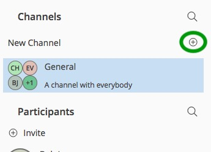
+
then, enter the Channel's name and topic, select any buddies to invite
and finally, click on "Create".
+
image:images/new_channel_2.jpg[new_channel_2.jpg,title="new_channel_2.jpg"]

* Joining a Channel
+
To join a Channel, click on the Channel itself and then on "Join
Channel"
+
image:images/join_channel_1.jpg[join_channel_1.jpg,title="join_channel_1.jpg"]

* Inviting a Buddy to a Channel
+
To invite one or more buddies to a Channel, click on the "Invite" button
under "Channel Participants", select the buddies you wish to add and
then click on "Invite"
+
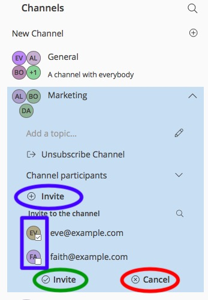

* Sending a file to all members of a Channel
+
To send a file to all members of a Channel, click on the "paperclip" icon in the Channel's chat window.
+

+
Files sent to a Channel will be uploaded to a dedicated personal briefcase before being shared.

* Starting a Channel video chat
+
To start a Channel video chat, click on the "Camera" icon on the
Channel's chat window.
+

+
Any member of the Channel can join the call at any time by clicking on
the same button.

* Leaving a Channel
+
To leave a Channel, first click on "Unsubscribe Channel" in the
Channel's properties
+
image:images/leave_channel_1.jpg[leave_channel_1.jpg,title="leave_channel_1.jpg"]
+
then, click on "Leave" under the warning message.
+
image:images/leave_channel_2.jpg[leave_channel_2.jpg,title="leave_channel_2.jpg"]

== Video Chat

Videoconferencing features are available in both Groups and Channels,
allowing multiple people to communicate in real-time using a webcam and a headset, as well as allowing them to share their screen with all
other attendees.

This feature is based on the WebRTC protocol, a peer-to-peer
auto-adaptive technology that allows clients to communicate directly
without overloading the server and whose call quality is automatically
tweaked based on the available bandwidth - with the maximum quality
being Full HD for both video and audio. The first time a video chat
is started, users will need to grant their browser access permissions to
their camera and microphone.

=== Video Chat UI

image:images/group_videochat.png[group_videochat.png,title="group_videochat.png"]

The video chat UI is split into three main areas:

* In the center, video streams are displayed with one main stream on the
top and multiple secondary streams on the bottom, whose number depends
on the screen's resolution and window size.
* On the top left, the Group's or Channel's instant messaging chat. This
is visible and fully usable, and its history is saved in the group's or
channel's chat history.
* On the bottom left, the user's own video feed and controls (disable video, mute microphone, and share screen).

Users can disconnect from an ongoing video chat by pressing the
"Hang up" button in their video stream's frame on the bottom left of the
screen. Whenever a video chat is on, users belonging to the Group
or Channel of the video chat will see a "Call in progress" message
below the name of the Group or Channel and will be able to join by
clicking on the "Camera" icon in the chat.

image:images/call_in_progress.png[call_in_progress.png,title="call_in_progress.png"]

==== Video Stream Control

By default, video streams are displayed in a "first come, first served"
basis according to the connection order between the peers.

At any time, users can open the video chat preferences to access
the "Participants" list and choose which streams to view by clicking on
the respective user's

image:images/videoconference_partecipants.png[videoconference_partecipants.png,title="videoconference_partecipants.png"]

* The "Eye" icon next to a participant's name will display or hide that
participant's video stream.
* The "Sound" icon next to a participant's name will block the audio
stream coming from that participant, effectively muting it for the user.

==== Screen Sharing

When clicking on the Screen Share button, a pop-up window appears asking
the user whether to share their entire screen or just a specific window:

image:images/group_videochat_screensharing.png[group_videochat_screensharing.png,title="group_videochat_screensharing.png"]

=== Instant Meeting - video chats with external users
The Instant Meeting feature provides a temporary invite-only group with video chat capabilities that can also include external users.

To start an Instant Meeting, simply select the "Instant Meeting" option in the "New" menu in the Talk Tab

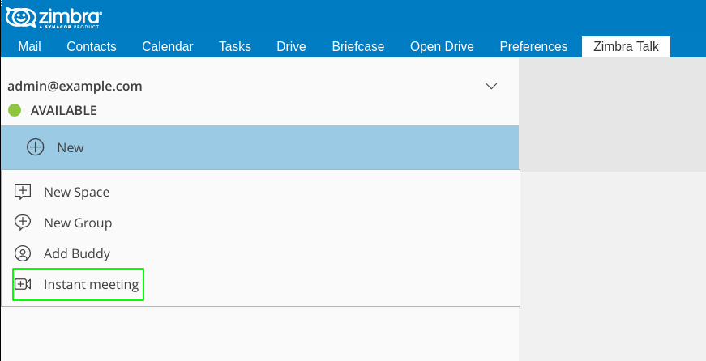

This will open the Instant Meeting Creation pop-up, where multiple users can be invited to participate, up to the maximum group size set by the Administrator.

image:images/talk_instant_meeting_creation.png[talk_instant_meeting_creation.png,title="talk_instant_meeting_creation.png"]

All the features and limitations of Groups apply to Instant Meetings, including the Video Call UI. Just like Groups, Instant Meetings appear in the Talk Tab and can be managed using the "Options" slide menu:

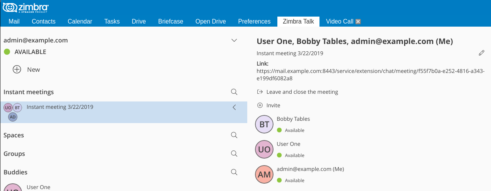

Attendees can exit the Instant Meeting at any time and will always be able to rejoin through the Instant Meeting Link or Zimbra Talk Tab.

==== Instant Meeting Link
Whenever an Instant Meeting is created, a unique link is generated to allow external users to join the corresponding Video Chat. The link is sent to all participants via email upon Instant Meeting creation, and can be found both in the Instant Meeting creation pop-up and in the Instant Meeting's properties.

When joining the Instant Meeting by accessing the link, attendees will need to enter their email address and a nickname in order to join:

image:images/talk_instant_meeting_login.png[talk_instant_meeting_login.png,title="talk_instant_meeting_login.png"]

==== Instant Meeting Host
Every Instant Meetings has a "Host", which is the user that created the Instant Meeting.

The Host can invite new people to the Instant Meeting and can end the meeting by simply leaving it.

When the host leaves the Instant Meeting, it will end and be closed.

== Presence

Presence management is inherited from Zimbra Chat and works the same
way: users can choose one of the four available status messages and
after a period of inactivity defined in the user's preferences, the
status is automatically set to "Away" (this latter feature has been
temporarily disabled and will be re-enabled in one of the next Zimbra
8.8.8 patches). As part of the presence system, all messages are now
displayed with a variable number of check symbols:

* 0 checks, message not delivered to the server
* 1 check, message delivered to the server
* 2 checks, message viewed by all users

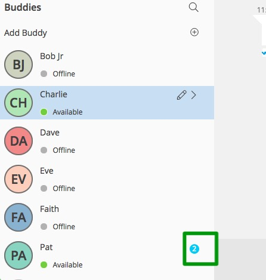

== Unread Messages

The number of unread messages in any conversation, Group or Channel is
always displayed on the top-right corner of the conversation, Group or
Channel itself.

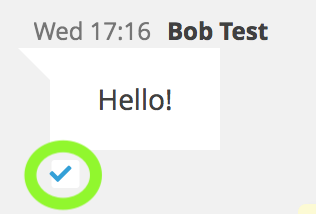

_Example of a message delivered to the server but not yet read by all
recipients._

== Chat History

Chat History for all 1-to-1 chats, groups, and channels is available in
the very same window (e.g. enter a Channel to see all of that channel’s
history) and messages delivered to offline users will appear in the
appropriate IM conversation, group or Channel.

== STUN/TURN Server

Since WebRTC is a peer-to-peer protocol, all users in a video chat
must be able to reach each other's client in order for the communication
to be established.

Should this not be possible, because of NAT rules on the network or
because of a Service Provider's policy, using a TURN server will ensure
proper communication between all peers. {ztalk-name} is designed to
allow using a STUN/TURN server out of the box by simply adding the TURN
server's URL and login information in the zimlet configuration.

=== Setting up {ztalk-name} to use a TURN server

A dedicated set of TURN configuration tools is available via CLI through
the `zxsuite chat iceServer` command:

....
zimbra@mailserver:~$ zxsuite chat iceServer

Edit the list of ice servers which will be used to establish connections for video calls.
Configuration available for global(default), cos or account.

  add                      - add ice server candidates using global (default), cos or account
                             zxsuite chat iceServer add {turn:turn.example.com:3478?transport=udp} [attr1 value1 [attr2 value2...]]

  remove                   - remove ice server candidates using global (default), cos or account
                             zxsuite chat iceServer remove {turn:turn.example.com:3478?transport=udp} [attr1 value1 [attr2 value2...]]

  get                      - get ice server candidates using global (default), cos or account
                             zxsuite chat iceServer get [attr1 value1 [attr2 value2...]]
....

The "add" subcommand is used to add a new TURN server:

....
Syntax:
   zxsuite chat iceServer add {turn:turn.example.com:3478?transport=udp} [attr1 value1 [attr2 value2...]]

PARAMETER LIST

NAME             TYPE      EXPECTED VALUES
url(M)           String    turn:turn.example.com:3478?transport=udp
username(O)      String    myuser
credential(O)    String    mysecretkey
account(O)       String    user@example.com
cos(O)           String    default

(M) == mandatory parameter, (O) == optional parameter

Usage example:

zxsuite chat iceserver add turn:turn.example.com credential mysecret username myuser
zxsuite chat iceserver add turn:turn.example.com credential mysecret username myuser account testaccount@example.com
....

Multiple TURN servers can be added to handle different users or Classes
of Service (defined through the `user` and `cos` optional parameters of
the command above).

On the TURN server side, having a single user and authenticating with
their username and secret key is highly suggested for ease-of-use reasons,
as a 1:1 correspondence between Zimbra users and TURN users is not
necessary.

== CLI

Basic Usage:

`zxsuite chat {action} [options]`

Running a command without arguments will display the command's usage
message.

Running `zxsuite chat` without any command will display the list of
available commands.

=== {ztalk-name} CLI

::
  *doAddBuddies* - Makes two users chat buddies

`zxsuite chat doAddBuddies {user1} {user2} [attr1 value1 [attr2 value2...]]`

::
  *doCleanup* - Remove deleted users/friendships (executed periodically)

`zxsuite chat doCleanup`

::
  *doMakeBuddies* - Makes all users in a distribution list friends with
  each other

`zxsuite chat doMakeBuddies {distribution_list}`

::
  *doRemoveBuddies* - Unbuddy two users

`zxsuite chat doRemoveBuddies {user1} {user2}`

::
  *doRestartService* - restart a given service

`zxsuite chat doRestartService {service_name}`

::
  *doStartService* - start a given service

`zxsuite chat doStartService {service_name}`

::
  *doStopService* - stop a given service

`zxsuite chat doStopService {service_name}`

::
  *getAccountStatus* - Get current account status

`zxsuite chat getAccountStatus {account}`

::
  *getBuddyList* - Shows a user's buddyList

`zxsuite chat getBuddyList {account}`

::
  *getProperty* - Get configuration properties

`zxsuite chat getProperty [attr1 value1 [attr2 value2...]]`

::
  *getRooms* - list rooms

`zxsuite chat getRooms [attr1 value1 [attr2 value2...]]`

::
  *getServerStatus* - Get current chat server status

`zxsuite chat getServerStatus`

::
  *getServices* - show the current status of all services for this module

`zxsuite chat getServices`

::
  *iceServer* - Edit the list of ice servers which will be used to establish connections for video calls. Configuration available for
  global(default), cos or account.

`zxsuite chat iceServer`

::
  *setProperty* - Set configuration property

`zxsuite chat setProperty {property_name} {property_value}`
